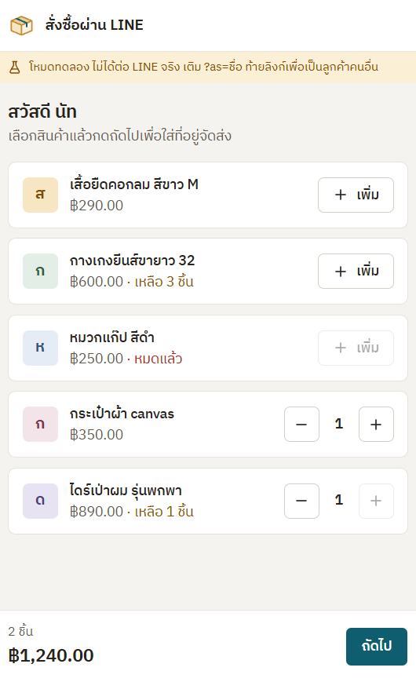
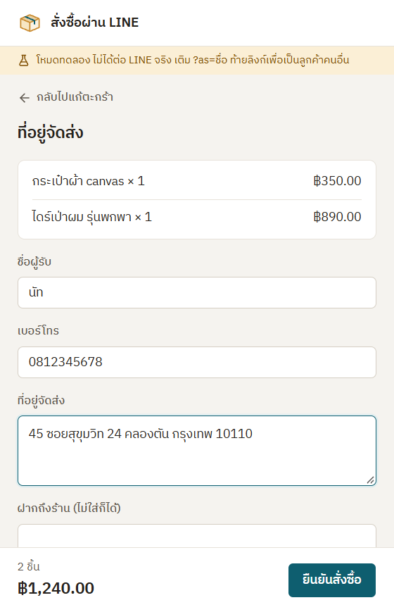
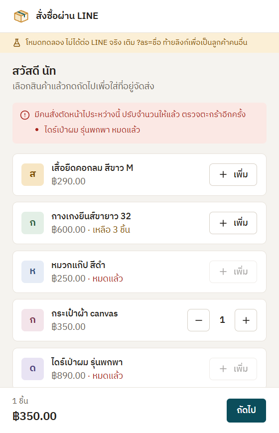
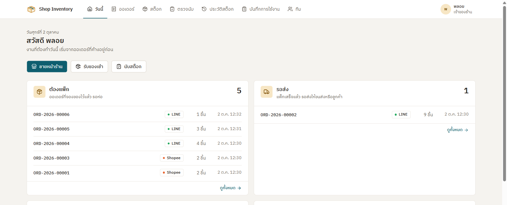
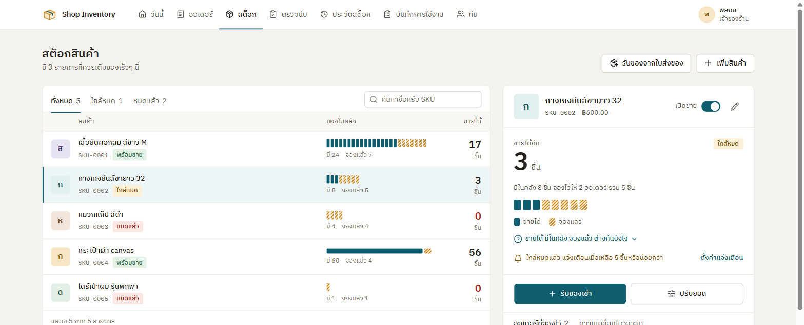
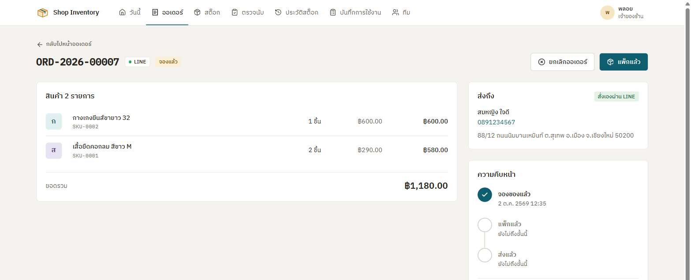
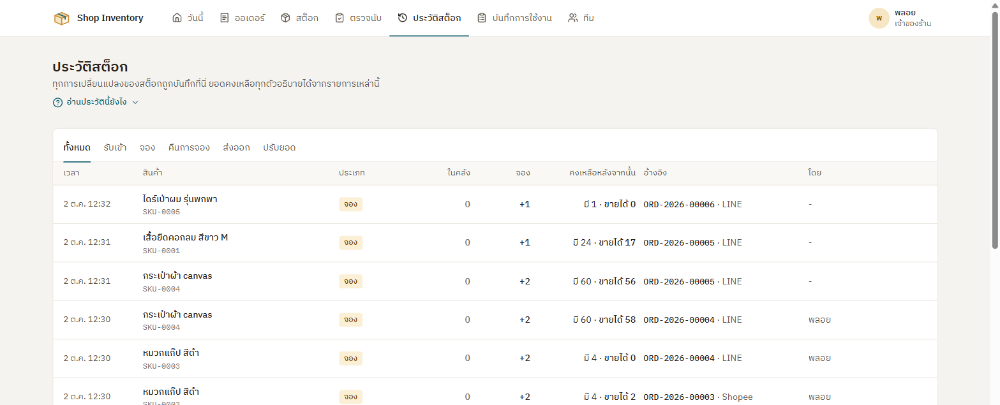
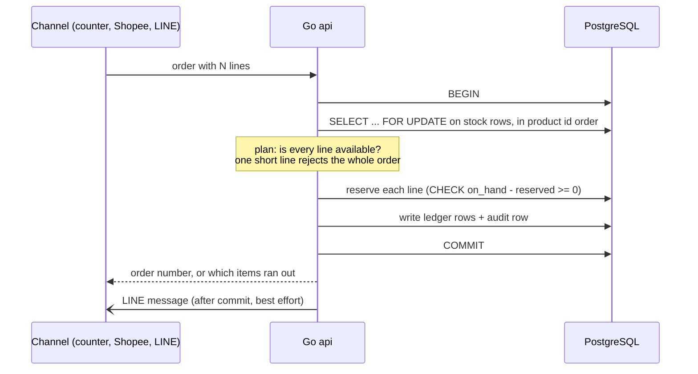

# shop-inventory-app

A back office for a small shop that sells **one pool of stock** through its
store counter, Shopee and LINE. Staff take orders from every channel, pack and
ship them, receive deliveries and count the shelves; customers can also order
themselves inside LINE.

## The problem

When three channels sell the same 5 units, two customers can buy "the last
one" at the same moment. Most small shops find out when they have to cancel an
order and apologise. This system makes that impossible, not just unlikely:

```
available = on_hand - reserved
```

An order **reserves** stock the moment it is placed, then either **ships** it
(on_hand and reserved both drop) or is **canceled** (the reservation is
released). `available` is never stored, and the database refuses any row where
it would go negative.

## What it looks like

A customer in LINE puts the last hair dryer in the cart. While they type the
address, someone else buys it. When they confirm, the order is refused and the
cart is corrected, instead of the shop overselling and apologising later.

| Cart in LINE | Delivery details | Someone was faster |
|---|---|---|
|  |  |  |

The back office, where staff see work from every channel in one place:









## How an order is placed

Every channel, whether it is a counter sale, a Shopee order typed in by staff
or a customer ordering in LINE, goes through the same path:



- **Row locks in a fixed order** make concurrent orders for the same products
  queue instead of racing or deadlocking.
- **All or nothing:** if one line is short nothing is reserved, and the reply
  lists every short line so the customer fixes the cart in one go.
- **The database is the last guard.** A check constraint rejects a negative
  balance even if a future code path forgets the lock.
- **Every stock change writes a ledger row in the same transaction**, with the
  balance after it, so the history always explains the current number.

## Proving it

`backend/internal/orders/oversell_integration_test.go` runs against a real
postgres (`make test-integration`):

- 40 concurrent orders for 5 units: exactly 5 succeed, nothing goes negative,
  and replaying the ledger rebuilds the balance.
- Multi-item orders racing each other are never half reserved.
- A LINE customer and a counter sale race for the last unit: exactly one wins.

## What it does

| Area | Features |
|---|---|
| Orders | Counter sale in one step, Shopee/LINE orders entered by staff, reserve, pack, ship, cancel |
| LINE | Customers order in a LIFF form inside LINE and get a message at each step ([setup](docs/LINE-SETUP.md)) |
| Stock | Opening stock, receiving a whole delivery note, adjustments, undoing a mistyped entry within 7 days |
| Counting | Staff count the shelves, the owner approves, differences become ledger rows |
| Overview | A today page with orders to pack and ship, products running low and counts to approve |
| Trust | Owner and staff roles, a stock ledger and an audit log of who did what |

## A five-minute demo

After `make seed` there is a hair dryer (SKU-0005) with exactly one unit left.

1. Sign in as the owner. The today page lists orders waiting to be packed.
2. Open `/line?as=ploy` and `/line?as=nat` side by side (dev mode needs no LINE
   account). Both put the hair dryer in the cart and confirm. One gets an order
   number; the other is told it just sold out.
3. Back office: the order shows who it ships to. Pack it, then ship it. The api
   log shows the LINE messages the customer would receive.
4. Ledger: each step is a row with the balance after it. Receive 50 of
   something by mistake, then undo it; both rows stay in the history.
5. Sign in as staff, count a shelf with a difference, then approve it as the
   owner and watch the balance and ledger follow.

## Design decisions

The reasoning behind the code lives in [docs/CODE-NOTES.md](docs/CODE-NOTES.md).
A few that come up in conversation:

- **Session cookies, not JWTs.** Logout and disabling a member take effect on
  the next request, because a session is a row that can be deleted.
- **The stock rule is a plain function.** The repository locks the rows and
  then calls it inside the transaction, so the rule is unit tested without a
  database while the guarantee still holds under concurrency.
- **The ledger is append-only.** A mistake is undone by an opposite entry that
  points at the original, never by editing history.
- **LINE messages are sent after commit and never roll back an order.** A slow
  LINE api should not cancel a sale; a lost message is logged.
- **Organised by feature** (`orders/`, `stock/`, `line/`), each with handler,
  service and repository, and lint rules that keep the web framework out of
  the business logic.

## Stack

- **Backend:** Go, Gin, pgx v5, sqlc, golang-migrate, log/slog
- **Frontend:** React 19, Vite, TypeScript, TanStack Router and Query, Tailwind CSS, shadcn/ui
- **Database:** PostgreSQL 17
- **Tooling:** golangci-lint, ESLint, Prettier, Vitest, GitHub Actions

## Prerequisites

| Tool | Notes |
|---|---|
| Go 1.25+ | The Makefile runs everything on go1.26.8 and downloads it automatically |
| Node 22.12+ | Required by Vite 8 |
| Docker | For postgres |
| GNU make | Windows: `scoop install make` or `winget install ezwinports.make` |
| [golang-migrate](https://github.com/golang-migrate/migrate) CLI | `migrate` |
| [sqlc](https://sqlc.dev) | Only needed to regenerate `backend/db/sqlc` |
| [golangci-lint](https://golangci-lint.run) v2 | For `make lint` |

## Getting started

```sh
cp .env.example .env

cd backend
make up            # postgres on localhost:5433, waits until healthy
make migrate-up
make seed          # dev accounts and sample stock, empty database only
make run           # api on http://localhost:8080
```

```sh
curl -i http://localhost:8080/healthz
# HTTP/1.1 200 OK
# {"status":"ok","db":"ok"}
```

`/healthz` answers `503 {"status":"degraded","db":"error"}` when the database is
unreachable.

`make seed` creates `owner@shop.local` and `staff@shop.local`; their passwords
are `SEED_OWNER_PASSWORD` and `SEED_STAFF_PASSWORD` in `.env`.

In a second terminal:

```sh
cd frontend
npm install
npm run dev        # http://localhost:5173, proxies /api and /healthz to the api on HTTP_PORT
```

## Running the whole shop with Docker

One image holds the api, the built frontend and the seed command. Only Docker
is needed:

```sh
cp .env.example .env               # set POSTGRES_PASSWORD and the SEED_* accounts
docker compose --profile app up -d --build
docker compose --profile app run --rm -e SEED_SAMPLE_DATA=false --entrypoint /app/seed app
```

The shop is then on `http://localhost:8080` (`APP_PORT` changes it). Migrations
run automatically on every `up`. The seed step creates the owner and staff
accounts once; it refuses to add sample data outside development.

Cookies are sent over plain http by default so the shop works on its own
network. Put it behind HTTPS and set `COOKIE_SECURE=true` before exposing it to
the internet.

## LINE ordering

`/line` is the customer form. In development it runs in dev mode with no LINE
account: sign-in is faked and messages go to the api log. To connect a real
LINE Official Account, follow [docs/LINE-SETUP.md](docs/LINE-SETUP.md).

## Checks

```sh
# backend/
make test
make test-integration   # needs postgres from make up
make lint

# frontend/
npm run lint
npm run typecheck
npm test
npm run build
```

CI runs the same checks on every push to `main` and every pull request.

## Project layout

```
api/openapi.yaml    API contract
backend/            Go api, migrations, sqlc queries and generated code
frontend/           React app
docker-compose.yml  PostgreSQL for development; the app profile runs everything
Dockerfile          One image: api, seed command and built frontend
```

See [CLAUDE.md](CLAUDE.md) for architecture rules, conventions and the reasoning
behind the pinned tool versions.
